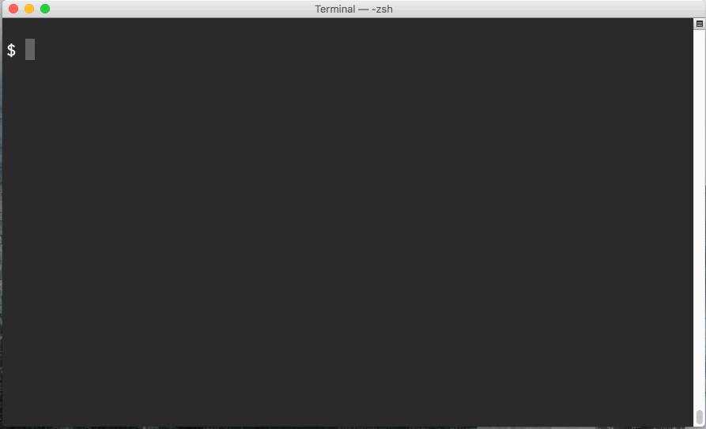

# sqldef [](https://travis-ci.org/k0kubun/sqldef)

The easiest idempotent MySQL/PostgreSQL/SQLite3 schema management by SQL.

This is inspired by [Ridgepole](https://github.com/winebarrel/ridgepole) but using SQL,
so there's no need to remember Ruby DSL.



## Installation

Download the single-binary executable for your favorite database from:

https://github.com/k0kubun/sqldef/releases

## Usage

### mysqldef

`mysqldef` should work in the same way as `mysql` for setting connection information.

```
$ mysqldef --help
Usage:
  mysqldef [options] db_name

Application Options:
  -u, --user=user_name       MySQL user name (default: root)
  -p, --password=password    MySQL user password, overridden by $MYSQL_PWD
  -h, --host=host_name       Host to connect to the MySQL server (default: 127.0.0.1)
  -P, --port=port_num        Port used for the connection (default: 3306)
  -S, --socket=socket        The socket file to use for connection
      --password-prompt      Force MySQL user password prompt
      --file=sql_file        Read schema SQL from the file, rather than stdin (default: -)
      --dry-run              Don't run DDLs but just show them
      --export               Just dump the current schema to stdout
      --skip-drop            Skip destructive changes such as DROP
      --help                 Show this help
```

#### Example

```sql
# Make sure that MySQL server can be connected by mysql(1)
$ mysql -uroot test -e "select 1;"
+---+
| 1 |
+---+
| 1 |
+---+

# Dump current schema by adding `def` suffix and --export
$ mysqldef -uroot test --export
CREATE TABLE `user` (
  `id` bigint(20) unsigned NOT NULL AUTO_INCREMENT,
  `name` varchar(191) DEFAULT 'k0kubun',
  PRIMARY KEY (`id`)
) ENGINE=InnoDB DEFAULT CHARSET=utf8mb4;

# Save it to edit
$ mysqldef -uroot test --export > schema.sql
```

Update the schema.sql like (instead of `ADD INDEX`, you can just add `KEY index_name (name)` in the `CREATE TABLE` as well):

```diff
 CREATE TABLE user (
   id BIGINT UNSIGNED NOT NULL AUTO_INCREMENT PRIMARY KEY,
   name VARCHAR(128) DEFAULT 'k0kubun',
+  created_at DATETIME NOT NULL
 ) Engine=InnoDB DEFAULT CHARSET=utf8mb4;
+
+ALTER TABLE user ADD INDEX index_name(name);
```

And then run:

```sql
# Check the auto-generated migration plan without execution
$ mysqldef -uroot test --dry-run < schema.sql
--- dry run ---
Run: 'ALTER TABLE user ADD COLUMN created_at datetime NOT NULL ;'
Run: 'ALTER TABLE user ADD INDEX index_name(name);'

# Run the above DDLs
$ mysqldef -uroot test < schema.sql
Run: 'ALTER TABLE user ADD COLUMN created_at datetime NOT NULL ;'
Run: 'ALTER TABLE user ADD INDEX index_name(name);'

# Operation is idempotent, safe for running it multiple times
$ mysqldef -uroot test < schema.sql
Nothing is modified

# Run without droping existing tables and columns
$ mysqldef -uroot test --skip-drop < schema.sql
Skipped: 'DROP TABLE users;'
```

### psqldef

`psqldef` should work in the same way as `psql` for setting connection information.

```
$ psqldef --help
Usage:
  psqldef [option...] db_name

Application Options:
  -U, --user=username        PostgreSQL user name (default: postgres)
  -W, --password=password    PostgreSQL user password, overridden by $PGPASS
  -h, --host=hostname        Host or socket directory to connect to the PostgreSQL server (default: 127.0.0.1)
  -p, --port=port            Port used for the connection (default: 5432)
      --password-prompt      Force PostgreSQL user password prompt
  -f, --file=filename        Read schema SQL from the file, rather than stdin (default: -)
      --dry-run              Don't run DDLs but just show them
      --export               Just dump the current schema to stdout
      --skip-drop            Skip destructive changes such as DROP
      --help                 Show this help
```

You can use `PGSSLMODE` environment variable to specify sslmode.

#### Example

```sql
# Make sure that PostgreSQL server can be connected by psql(1)
$ psql -U postgres test -c "select 1;"
 ?column?
----------
        1
(1 row)

# Dump current schema by adding `def` suffix and --export
$ psqldef -U postgres test --export
CREATE TABLE public.users (
    id bigint NOT NULL,
    name text,
    age integer
);

CREATE TABLE public.bigdata (
    data bigint
);

# Save it to edit
$ psqldef -U postgres test --export > schema.sql
```

Update the schema.sql like:

```diff
 CREATE TABLE users (
     id bigint NOT NULL PRIMARY KEY,
-    name text,
     age int
 );

-CREATE TABLE bigdata (
-    data bigint
-);
```

And then run:

```sql
# Check the auto-generated migration plan without execution
$ psqldef -U postgres test --dry-run < schema.sql
--- dry run ---
Run: 'DROP TABLE bigdata;'
Run: 'ALTER TABLE users DROP COLUMN name;'

# Run the above DDLs
$ psqldef -U postgres test < schema.sql
Run: 'DROP TABLE bigdata;'
Run: 'ALTER TABLE users DROP COLUMN name;'

# Operation is idempotent, safe for running it multiple times
$ psqldef -U postgres test < schema.sql
Nothing is modified

# Run without droping existing tables and columns
$ psqldef -U postgres test --skip-drop < schema.sql
Skipped: 'DROP TABLE users;'
```

### sqlite3def

```
$ sqlite3def --help
Usage:
  sqlite3def [option...] db_name

Application Options:
  -f, --file=filename    Read schema SQL from the file, rather than stdin (default: -)
      --dry-run          Don't run DDLs but just show them
      --export           Just dump the current schema to stdout
      --skip-drop        Skip destructive changes such as DROP
      --help             Show this help
```

## Supported features

Following DDLs can be generated by updating `CREATE TABLE`.
Some of them can also be used for input schema file.

- MySQL
  - Table: CREATE TABLE, DROP TABLE
  - Column: ADD COLUMN, CHANGE COLUMN, DROP COLUMN
  - Index: ADD INDEX, ADD UNIQUE INDEX, CREATE INDEX, CREATE UNIQUE INDEX, DROP INDEX
  - Primary key: ADD PRIMARY KEY, DROP PRIMARY KEY
  - Foreign Key: ADD FOREIGN KEY, DROP FOREIGN KEY
  - View: CREATE VIEW, CREATE OR REPLACE VIEW, DROP VIEW
- PostgreSQL
  - Table: CREATE TABLE, DROP TABLE
  - Column: ADD COLUMN, ALTER COLUMN, DROP COLUMN
  - Index: CREATE INDEX, CREATE UNIQUE INDEX, DROP INDEX
  - Foreign / Primary Key: ADD FOREIGN KEY, DROP CONSTRAINT
  - Policy: CREATE POLICY, DROP POLICY
  - View: CREATE VIEW, CREATE OR REPLACE VIEW, DROP VIEW
- SQLite3
  - Table: CREATE TABLE, DROP TABLE
  - View: CREATE VIEW, DROP VIEW

## MySQL examples
### CREATE TABLE
```diff
+CREATE TABLE users (
+  name VARCHAR(40) DEFAULT NULL
+);
```

Remove the statement to DROP TABLE.

### ADD COLUMN
```diff
 CREATE TABLE users (
   name VARCHAR(40) DEFAULT NULL,
+  created_at DATETIME NOT NULL
 );
```

Remove the line to DROP COLUMN.

### CHANGE COLUMN
```diff
 CREATE TABLE users (
-  name VARCHAR(40) DEFAULT NULL,
+  name CHAR(40) DEFAULT NULL,
   created_at DATETIME NOT NULL
 );
```

### ADD INDEX

```diff
 CREATE TABLE users (
   name CHAR(40) DEFAULT NULL,
   created_at DATETIME NOT NULL,
+  UNIQUE KEY index_name(name)
 );
```

or

```diff
 CREATE TABLE users (
   name CHAR(40) DEFAULT NULL,
   created_at DATETIME NOT NULL
 );
+
+ALTER TABLE users ADD UNIQUE INDEX index_name(name);
```

Remove the line to DROP INDEX.

### ADD PRIMARY KEY
```diff
 CREATE TABLE users (
+  id BIGINT UNSIGNED NOT NULL AUTO_INCREMENT PRIMARY KEY,
   name CHAR(40) DEFAULT NULL,
   created_at datetime NOT NULL,
   UNIQUE KEY index_name(name)
 );
```

Remove the line to DROP PRIMARY KEY.

Composite primary key may not work for now.

### ADD FOREIGN KEY

```diff
 CREATE TABLE users (
   id BIGINT UNSIGNED NOT NULL AUTO_INCREMENT PRIMARY KEY,
   name CHAR(40) DEFAULT NULL,
   created_at datetime NOT NULL,
   UNIQUE KEY index_name(name)
 );

 CREATE TABLE posts (
   user_id BIGINT UNSIGNED NOT NULL,
+  CONSTRAINT posts_ibfk_1 FOREIGN KEY (user_id) REFERENCES users (id)
 );
```

Remove the line to DROP FOREIGN KEY.

Composite foreign key may not work for now.

### CREATE (OR REPLACE) VIEW

```diff
 CREATE VIEW foo AS
   select u.id as id, p.id as post_id
   from  (
     mysqldef_test.users as u
     join mysqldef_test.posts as p on ((u.id = p.user_id))
   )
 ;
+ CREATE OR REPLACE VIEW foo AS select u.id as id, p.id as post_id from (mysqldef_test.users as u join mysqldef_test.posts as p on (((u.id = p.user_id) and (p.is_deleted = 0))));
```

Remove the line to DROP VIEW.

## PostgreSQL examples
### CREATE TABLE
```diff
+CREATE TABLE users (
+  id BIGINT PRIMARY KEY
+);
```

Remove the statement to DROP TABLE.

### ADD COLUMN
```diff
 CREATE TABLE users (
   id BIGINT PRIMARY KEY,
+  name VARCHAR(40)
 );
```

Remove the line to DROP COLUMN.

### CREATE INDEX

```diff
 CREATE TABLE users (
   id BIGINT PRIMARY KEY,
   name VARCHAR(40)
 );
+CREATE INDEX index_name on users (name);
```

Remove the line to DROP INDEX.

### ADD FOREIGN KEY

```diff
 CREATE TABLE users (
   id BIGINT PRIMARY KEY,
   name VARCHAR(40)
 );
 CREATE INDEX index_name on users (name);

 CREATE TABLE posts (
   user_id BIGINT,
+  CONSTRAINT fk_posts_user_id FOREIGN KEY (user_id) REFERENCES users (id)
 )
```

Remove the line to DROP CONSTRAINT.

### ADD POLICY

```diff
 CREATE TABLE users (
   id BIGINT PRIMARY KEY,
   name VARCHAR(40)
 );
 CREATE POLICY p_users ON users AS PERMISSIVE FOR ALL TO PUBLIC USING (id = (current_user)::integer) WITH CHECK ((name)::text = current_user)

+CREATE POLICY p_users ON users AS PERMISSIVE FOR ALL TO PUBLIC USING (id = (current_user)::integer) WITH CHECK ((name)::text = current_user)
```

Remove the line to DROP POLICY.

### CREATE (OR REPLACE) VIEW

```diff
 CREATE VIEW foo AS
   select u.id as id, p.id as post_id
   from  (
     mysqldef_test.users as u
     join mysqldef_test.posts as p on ((u.id = p.user_id))
   )
 ;
+ CREATE OR REPLACE VIEW foo AS select u.id as id, p.id as post_id from (users as u join posts as p on (((u.id = p.user_id) and (p.is_deleted = 0))));
```

Remove the line to DROP VIEW.

## Distributions
### Linux
A debian package might be supported in the future, but for now it has not been implemented yet.

```bash
# mysqldef
wget -O - https://github.com/k0kubun/sqldef/releases/latest/download/mysqldef_linux_amd64.tar.gz \
  | tar xvz

# psqldef
wget -O - https://github.com/k0kubun/sqldef/releases/latest/download/psqldef_linux_amd64.tar.gz \
  | tar xvz
```

### macOS
[Homebrew tap](https://github.com/sqldef/homebrew-sqldef) is available.

```
# mysqldef
brew install sqldef/sqldef/mysqldef

# psqldef
brew install sqldef/sqldef/psqldef
```

## Limitations

Because sqldef distinguishes table/index/column by its name, sqldef does NOT support:

- RENAME TABLE
- RENAME INDEX
  - DROP + ADD could be fine for index, though
- CHANGE COLUMN for rename

To rename them, you would need to rename manually and use `--export` again.

## Development

You can use the following command to prepare MySQL and PostgreSQL to be used for running tests.

```
$ sudo apt install mysql-client postgresql-client
$ docker-compose up
$ make test-mysqldef MYSQL_HOST=127.0.0.1
$ make test-psqldef PGHOST=127.0.0.1 PGSSLMODE=disable
```

## License

Unless otherwise noted, the sqldef source files are distributed under the MIT License found in the LICENSE file.

[sqlparser](./sqlparser) is distributed under the Apache Version 2.0 license found in the sqlparser/LICENSE.md file.
