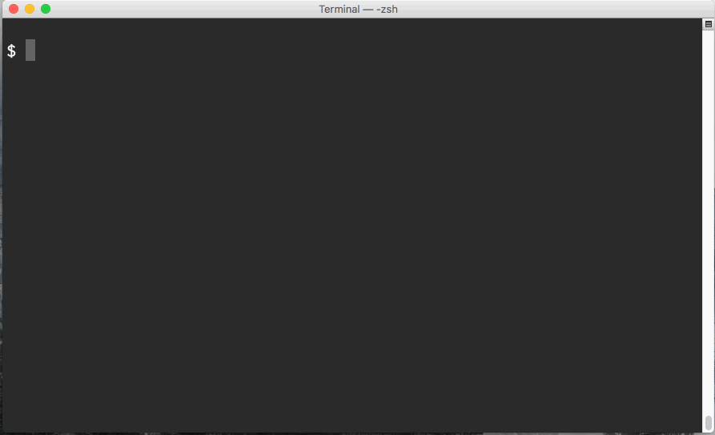

# sqldef [](https://github.com/sqldef/sqldef/actions/workflows/sqldef.yml) [](https://codecov.io/github/sqldef/sqldef)

**sqldef** is the easiest idempotent schema management tool for MySQL, PostgreSQL, SQLite3, and SQL Server that uses plain SQL DDLs. Define your desired schema in SQL, and sqldef generates and applies the migrations to update your database.

With sqldef, you maintain a single SQL file with your complete schema. To modify your schema - add columns, change constraints, or create indexes - simply edit this file. sqldef compares desired against current schema and generates the appropriate DDLs, ensuring your database reaches the desired state from any starting point.

Each database gets its own command (`mysqldef`, `psqldef`, `sqlite3def`, `mssqldef`) that mimics the connection options of the native database client, making it familiar and easy to integrate into existing workflows. The tool comes as a single binary with no dependencies, and provides idempotent operations that are safe to run multiple times.

This is inspired by [Ridgepole](https://github.com/ridgepole/ridgepole), which uses Ruby DSL. However, sqldef uses plain SQL, so all you need to remember is SQL.



## Supported Databases

- mysqldef - MySQL, MariaDB, and TiDB
- psqldef - PostgreSQL
- sqlite3def - SQLite3
- mssqldef - SQL Server

See [CI workflow](.github/workflows/sqldef.yml) for tested versions.

## Usage

### Basic Workflow

This is the basic workflow, which is identical across all databases - only the connection options differ between commands.

**Note:** Replace `$sqldef` with the appropriate command for your database:

- `mysqldef` for MySQL
- `psqldef` for PostgreSQL
- `sqlite3def` for SQLite
- `mssqldef` for SQL Server

#### 1. Export Current Schema

```shell
$sqldef [connection-options] --export > schema.sql
```

Export the existing database schema to review your starting point.

#### 2. Modify the Schema

Edit `schema.sql` to add, remove, or change columns/tables/indexes:

```sql
CREATE TABLE users (
  id BIGINT PRIMARY KEY,
  name VARCHAR(100),
  age INTEGER,  -- Added new column
  created_at TIMESTAMP
);
```

#### 3. Preview Changes

```shell
$sqldef [connection-options] --dry-run < schema.sql
```

Show the migrations that will be applied without executing them (e.g., `ALTER TABLE users ADD COLUMN age INTEGER`).

#### 4. Apply Changes

```shell
$sqldef [connection-options] --apply < schema.sql
```

Apply the necessary DDLs to transform current schema to desired state.

Running again shows no changes needed - operations are idempotent.

### Offline Mode

sqldef can compare two SQL files without connecting to a database. This is useful for CI/CD pipelines, schema validation, and generating migration scripts.

To use offline mode, specify a `.sql` file as the database argument:

```shell
# Compare current.sql with desired.sql
$sqldef current.sql < desired.sql
```

See the command documentation for more details on offline mode features.

### Renaming Tables, Columns, and Indexes

sqldef supports renaming tables, columns, and indexes using the `-- @renamed from=old_name` annotation.

Given the current schema:

```sql
CREATE TABLE user_accounts (
  id INTEGER PRIMARY KEY,
  username TEXT,
  age INTEGER
);
```

And the desired schema with `@renamed` annotation:

```sql
CREATE TABLE users ( -- @renamed from=user_accounts
  id INTEGER PRIMARY KEY,
  username TEXT,
  age INTEGER
);
```

This generates the following migration:

```sql
ALTER TABLE user_accounts RENAME TO users;
```

Also `@renamed` works for columns, indexes, and ENUM values. See command documentation for more details.

## Supported Mutations

sqldef compares a desired schema to the current one and emits DDL to close the gap. Engines do not all accept the same `ALTER` forms: some mutations are in-place, some replace an object, and some require rebuilding a table or moving dependents out of the way. The tables below record, for each scenario, the mutation strategy that engine requires and whether sqldef implements it.

#### Key: Mutation strategy

These are the names of strategies the **engine** prefers in a given mutation scenario.

| Strategy | Meaning |
|---|---|
| `alter` | In-place `ALTER` / `CHANGE` / `sp_rename` (also `GRANT` / `REVOKE`, `ALTER TYPE`, `ENABLE ROW LEVEL SECURITY`) |
| `replace` | `CREATE OR REPLACE` / `CREATE OR ALTER` |
| `drop_create` | Drop and create **this** object; that is the engine’s way to change it. The `DROP` half needs [`--enable-drop`](#command-documentation) (default off). |
| `dependents` | Do the inner `alter`/`replace`/`drop_create`, with blockers dropped and recreated around it. Dropping blockers needs [`--enable-drop`](#command-documentation) (default off). |
| `column_copy` | Add column, copy data, drop old column |
| `table_rebuild` | Copy/swap the table |
| `n/a` | Object or mutation does not exist on this engine (no status) |

#### Key: Status

The icon is the way **sqldef** implements the mutation strategy.

| Icon | Status | Meaning |
|---|---|---|
| ✅ | Does it | sqldef implements the engine's preferred strategy |
| ⚠️ | Partial | Converges, but not via the preferred strategy |
| ❌ | Missing | Does not converge (skip, illegal SQL, or apply error) |

### Support Matrix

Each cell is `strategy` then icon: strategy = engine requirement; icon = whether sqldef does that.

| Scenario | PostgreSQL | MySQL | SQL Server | SQLite |
|---|---|---|---|---|
| Add column | `alter` ✅ | `alter` ✅ | `alter` ✅ | `alter` ✅ |
| Drop column | `alter` ✅ | `alter` ✅ | `alter` ✅ | `alter` ✅ |
| Drop column used by a view | `dependents` ❌[^1] | `alter` ✅ | `alter` ✅ | `dependents` ❌[^2] |
| Drop column used by a schema-bound view | `n/a` | `n/a` | `dependents` ❌[^3] | `n/a` |
| Rename table | `alter` ✅ | `alter` ✅ | `alter` ✅ | `alter` ✅ |
| Rename column | `alter` ✅ | `alter` ✅ | `alter` ✅ | `alter` ✅ |
| Rename column and change type | `alter` ✅ | `alter` ✅ | `alter` ✅ | `column_copy` ✅ |
| Change column type | `alter` ✅ | `alter` ✅ | `alter` ✅ | `table_rebuild` ❌[^4] |
| Change column type used by a view | `dependents` ❌[^1] | `alter` ✅ | `alter` ✅ | `table_rebuild` ❌[^4] |
| Change column type used by a schema-bound view | `n/a` | `n/a` | `dependents` ❌[^3] | `n/a` |
| Change nullability | `alter` ✅ | `alter` ✅ | `alter` ✅ | `alter` ❌[^5] |
| Change default | `alter` ✅ | `alter` ✅ | `drop_create` ✅ | `table_rebuild` ❌[^4] |
| Add generated column (VIRTUAL) | `alter` ✅ | `alter` ✅ | `alter` ❌[^6] | `alter` ✅ |
| Add generated column (STORED) | `alter` ✅ | `alter` ✅ (TiDB `n/a`[^8]) | `alter` ❌[^6] | `table_rebuild` ❌[^4] |
| Change generated column storage | `drop_create` ❌[^7] | `drop_create` ✅ (TiDB `n/a`[^19]) | `alter` ❌[^6] | `table_rebuild` ❌[^4] |
| Add/change identity / AUTO_INCREMENT | `alter` ✅ | `alter` ✅ (TiDB `n/a`[^20]) | `table_rebuild` ❌[^21] | `table_rebuild` ❌[^4] |
| Add unique constraint | `alter` ✅ | `alter` ✅ | `alter` ✅ | `table_rebuild` ❌[^4] |
| Change unique constraint | `drop_create` ✅ | `drop_create` ✅ | `drop_create` ✅ | `table_rebuild` ❌[^4] |
| Add foreign key | `alter` ✅ | `alter` ✅ | `alter` ✅ | `table_rebuild` ❌[^4] |
| Change foreign key | `drop_create` ✅ | `drop_create` ✅ | `drop_create` ✅ | `table_rebuild` ❌[^4] |
| Add primary key | `alter` ✅ | `alter` ✅ | `alter` ✅ | `table_rebuild` ❌[^4] |
| Change primary key | `drop_create` ✅ | `drop_create` ✅ (TiDB `n/a`[^9]) | `drop_create` ✅ | `table_rebuild` ❌[^4] |
| Change primary key referenced by a foreign key | `dependents` ✅ | `dependents` ✅ (TiDB `n/a`[^9]) | `dependents` ✅ | `table_rebuild` ❌[^4] |
| Add CHECK | `alter` ✅ | `alter` ✅ | `alter` ✅ | `alter` ✅ |
| Change CHECK | `drop_create` ✅ | `drop_create` ✅ | `drop_create` ✅ | `drop_create` ❌[^5] |
| Add index | `alter` ✅ | `alter` ✅ | `alter` ✅ | `alter` ✅ |
| Change index | `drop_create` ✅ | `drop_create` ✅ | `drop_create` ✅ | `drop_create` ✅ |
| Rename index | `alter` ✅ | `alter` ✅ | `alter` ✅ | `drop_create` ✅ |
| Add enum value | `alter` ✅ | `alter` ✅ | `n/a` | `n/a` |
| Rename enum value | `alter` ✅ | `n/a` | `n/a` | `n/a` |
| Change view | `replace` ✅ | `replace` ✅ | `replace` ⚠️[^10] | `drop_create` ✅ |
| Change view used by another view | `dependents` ✅ | `replace` ✅ | `replace` ⚠️[^10] | `dependents` ⚠️[^11] |
| Change materialized view | `drop_create` ❌[^22] | `n/a` | `n/a` | `n/a` |
| Change trigger | `replace` ⚠️[^12] | `drop_create` ✅ (TiDB `n/a`[^13]) | `replace` ✅ | `drop_create` ✅ |
| Change function body | `replace` ✅ | `drop_create` ❌[^14] | `replace` ❌[^15] | `n/a` |
| Change function signature | `drop_create` ✅ | `drop_create` ❌[^14] | `drop_create` ❌[^15] | `n/a` |
| Change policy | `drop_create` ✅ | `n/a` | `n/a` | `n/a` |
| Enable/force row level security | `alter` ✅ | `n/a` | `n/a` | `n/a` |
| Change privileges | `alter` ✅[^16] | `alter` ❌[^17] | `alter` ❌[^18] | `n/a` |

[^1]: PostgreSQL rejects [`DROP COLUMN`](https://www.postgresql.org/docs/current/sql-altertable.html) and [`ALTER COLUMN … TYPE`](https://www.postgresql.org/docs/current/sql-altertable.html) while a view depends on the column. Drop and recreate those views around the `ALTER`. sqldef emits the inner `ALTER` only, so apply fails. [#1130](https://github.com/sqldef/sqldef/discussions/1130)

[^2]: SQLite [`DROP COLUMN`](https://www.sqlite.org/lang_altertable.html#alter_table_drop_column) fails if the column appears in a view. Drop and recreate those views around the `DROP COLUMN`. sqldef emits `DROP COLUMN` while the view remains.

[^3]: SQL Server [schema-bound views](https://learn.microsoft.com/en-us/sql/t-sql/statements/create-view-transact-sql) (`WITH SCHEMABINDING`) block `DROP COLUMN` / `ALTER COLUMN`. Drop and recreate those views around the `ALTER`. sqldef emits the inner `ALTER` only, so apply fails. Ordinary views do not block these mutations.

[^4]: SQLite [12-step table rebuild](https://www.sqlite.org/lang_altertable.html#making_other_kinds_of_table_schema_changes) for mutations `ALTER TABLE` cannot express (type, default, unique constraint, foreign key, primary key, STORED generated column, identity). sqldef does not rebuild tables: some of these skip, others emit illegal `ALTER TABLE … ADD CONSTRAINT`. [#1218](https://github.com/sqldef/sqldef/discussions/1218)

[^5]: SQLite 3.53+ can [`SET`/`DROP NOT NULL`](https://www.sqlite.org/lang_altertable.html#alter_table_alter_column) and [add or drop CHECK constraints](https://sqlite.org/releaselog/3_53_0.html). sqldef adds new CHECKs but skips CHECK edits and nullability changes.

[^6]: SQL Server computed columns: [`ALTER TABLE … ADD`](https://learn.microsoft.com/en-us/sql/t-sql/statements/alter-table-transact-sql) for a new computed column; [`ALTER COLUMN … ADD|DROP PERSISTED`](https://learn.microsoft.com/en-us/sql/t-sql/statements/alter-table-transact-sql) to change storage. sqldef does not parse `PERSISTED`.

[^7]: PostgreSQL 18 can store generated columns as `VIRTUAL` or `STORED`; there is no in-place switch ([generated columns](https://www.postgresql.org/docs/current/ddl-generated-columns.html)). sqldef does not diff generated-column storage on PostgreSQL. Adding a generated column still uses `ADD COLUMN`.

[^8]: TiDB cannot add a [`STORED` generated column](https://docs.pingcap.com/tidb/stable/generated-columns) through `ALTER TABLE`.

[^9]: TiDB cannot [`DROP PRIMARY KEY`](https://docs.pingcap.com/tidb/stable/clustered-indexes) on a clustered index.

[^10]: SQL Server [`CREATE OR ALTER VIEW`](https://learn.microsoft.com/en-us/sql/t-sql/statements/create-view-transact-sql) (2016 SP1+) keeps permissions. sqldef always `DROP VIEW` + `CREATE VIEW`.

[^11]: Nested view changes on SQLite usually apply because [`DROP VIEW`](https://sqlite.org/lang_dropview.html) is not `RESTRICT`, but sqldef does not order dependent views.

[^12]: PostgreSQL 14+ [`CREATE OR REPLACE TRIGGER`](https://www.postgresql.org/docs/current/sql-createtrigger.html). sqldef uses `DROP TRIGGER` + `CREATE TRIGGER`.

[^13]: TiDB has no [triggers](https://docs.pingcap.com/tidb/stable/mysql-compatibility).

[^14]: MySQL [`ALTER FUNCTION`](https://dev.mysql.com/doc/refman/8.4/en/alter-function.html) cannot change the body or signature; the engine requires `DROP FUNCTION` + `CREATE FUNCTION`. mysqldef does not export or manage stored functions.

[^15]: SQL Server [`CREATE OR ALTER FUNCTION`](https://learn.microsoft.com/en-us/sql/t-sql/statements/create-function-transact-sql) for the body; `DROP` + `CREATE` when the function kind or signature cannot be altered. mssqldef does not manage functions.

[^16]: PostgreSQL [`GRANT`](https://www.postgresql.org/docs/current/sql-grant.html) / [`REVOKE`](https://www.postgresql.org/docs/current/sql-revoke.html) for roles listed in `managed_roles` (see [psqldef](./cmd-psqldef.md)).

[^17]: MySQL [`GRANT`](https://dev.mysql.com/doc/refman/8.4/en/grant.html) / [`REVOKE`](https://dev.mysql.com/doc/refman/8.4/en/revoke.html). mysqldef does not emit them.

[^18]: SQL Server [`GRANT`](https://learn.microsoft.com/en-us/sql/t-sql/statements/grant-transact-sql). mssqldef does not emit `GRANT`/`REVOKE`.

[^19]: TiDB cannot convert a generated column between `VIRTUAL` and `STORED` through [`ALTER TABLE`](https://docs.pingcap.com/tidb/stable/generated-columns).

[^20]: TiDB cannot add [`AUTO_INCREMENT`](https://docs.pingcap.com/tidb/stable/auto-increment) to an existing column.

[^21]: SQL Server cannot add [`IDENTITY`](https://learn.microsoft.com/en-us/sql/t-sql/statements/alter-table-column-definition-transact-sql) to an existing column. sqldef emits `DROP COLUMN` + `ADD`.

[^22]: PostgreSQL [`CREATE MATERIALIZED VIEW`](https://www.postgresql.org/docs/current/sql-creatematerializedview.html) has no `OR REPLACE`. sqldef creates and drops materialized views but does not compare an existing definition.

## Command Documentation

* [mysqldef](./cmd-mysqldef.md)
* [psqldef](./cmd-psqldef.md)
* [sqlite3def](./cmd-sqlite3def.md)
* [mssqldef](./cmd-mssqldef.md)

## Examples

See practical examples in the [example](./example) directory:

```shell
# Database mode - apply schema changes to a running database
./example/run.sh psqldef      # PostgreSQL
./example/run.sh mysqldef     # MySQL/MariaDB
./example/run.sh sqlite3def   # SQLite3
./example/run.sh mssqldef     # SQL Server

# Offline mode - compare schema files without database connection
./example/run-offline.sh psqldef      # PostgreSQL
./example/run-offline.sh mysqldef     # MySQL/MariaDB
./example/run-offline.sh sqlite3def   # SQLite3
./example/run-offline.sh mssqldef     # SQL Server
```

## Installation

### Pre-built binaries

Download the single-binary executable for your favorite database from:

https://github.com/sqldef/sqldef/releases

### Docker images

Docker images are available on Docker Hub:

https://hub.docker.com/u/sqldef

### Linux

Debian packages are not currently available. Use the pre-built binaries or Docker images instead.

```shell
# mysqldef
wget -O - https://github.com/sqldef/sqldef/releases/latest/download/mysqldef_linux_amd64.tar.gz \
  | tar xvz

# psqldef
wget -O - https://github.com/sqldef/sqldef/releases/latest/download/psqldef_linux_amd64.tar.gz \
  | tar xvz

# sqlite3def
wget -O - https://github.com/sqldef/sqldef/releases/latest/download/sqlite3def_linux_amd64.tar.gz \
  | tar xvz

# mssqldef
wget -O - https://github.com/sqldef/sqldef/releases/latest/download/mssqldef_linux_amd64.tar.gz \
  | tar xvz
```

### macOS

[Homebrew tap](https://github.com/sqldef/homebrew-sqldef) is available.

```shell
# mysqldef
brew install sqldef/sqldef/mysqldef

# psqldef
brew install sqldef/sqldef/psqldef

# sqlite3def
brew install sqldef/sqldef/sqlite3def

# mssqldef
brew install sqldef/sqldef/mssqldef
```

## Preview Changes with GitHub Actions

There's a GitHub Action that can preview changes to your database schema:

https://github.com/sqldef/sqldef-preview-action

## Development

If you update `parser/parser.y`, run:

```shell
$ make parser
```

Use the following commands to prepare command line tools and DB servers for running tests.

```shell
# Linux
$ sudo apt install mysql-client postgresql-client sqlite3
$ curl https://packages.microsoft.com/keys/microsoft.asc | sudo apt-key add -
$ curl https://packages.microsoft.com/config/ubuntu/22.04/prod.list | sudo tee /etc/apt/sources.list.d/msprod.list
$ sudo apt-get update && sudo apt-get install mssql-tools # then add: export PATH="$PATH:/opt/mssql-tools/bin"

# macOS
$ brew install libpq && brew link --force libpq
$ brew install microsoft/mssql-release/mssql-tools

# Start database
$ docker compose up

# Run all tests
$ make test

# Run *def tests
$ go test ./cmd/*def

# Run a single test
$ go test ./cmd/mysqldef -run=TestApply/CreateTable
```

### Run example scripts

Test all database mode examples:

```sh
make test-example
```

This runs `./example/run.sh` for all tools. You need to have the respective databases running:
- `./example/run.sh psqldef` - requires PostgreSQL
- `./example/run.sh mysqldef` - requires MySQL/MariaDB
- `./example/run.sh sqlite3def` - requires SQLite3 (no server needed)
- `./example/run.sh mssqldef` - requires SQL Server

Test all offline mode examples (no database required):

```sh
make test-example-offline
```

This runs `./example/run-offline.sh` for all tools (psqldef, mysqldef, sqlite3def, mssqldef). These examples demonstrate offline mode (file-to-file comparison) without requiring database connections.


## Contributing

Please file a pull request if you have a feature request.

If you're unsure what to do, you may file a "Feature requests" ticket on [Discussions](https://github.com/sqldef/sqldef/discussions)
and discuss how to implement that with the community.

## Releasing

The `tagpr` and `sqldef` workflows are used to release sqldef.

1. (optional) A maintainer labels a pull request (PR) with `minor` or `major` to manage the next version.
2. When a PR is merged to the default branch, `tagpr` creates a PR to bump the version and update the CHANGELOG.md ("release PR").
3. **A maintainer reviews the release PR and merges it.**
4. `tagpr` creates and pushes a release tag, which triggers the next workflow.
5. `sqldef` workflows creates a GitHub release, build artifacts, upload them to the GitHub release.

Unless it's a pretty big change that needs a discussion, we encourage sqldef maintainers to merge and release
their own Pull Requests without asking/waiting for reviews.

We also expect them to release sqldef as frequently as possible.
When there's a behavior change, sqldef should have at least one release on that day.

## Maintainers

* **@k0kubun**
* **@knaka** (sqlite3def)
* **@odz** (mssqldef)
* **@hokaccha** (psqldef)
* **@gfx** (psqldef)

These are the component they were contributing to when they became a maintainer,
but they're allowed to maintain every part of sqldef.

### Alumni

* **@ytakaya** (mssqldef)

## License

Unless otherwise noted, the sqldef source files are distributed under the MIT License found in the LICENSE file.

[parser](./parser) is distributed under the Apache Version 2.0 license found in the [parser/LICENSE.md](./parser/LICENSE.md) file.
